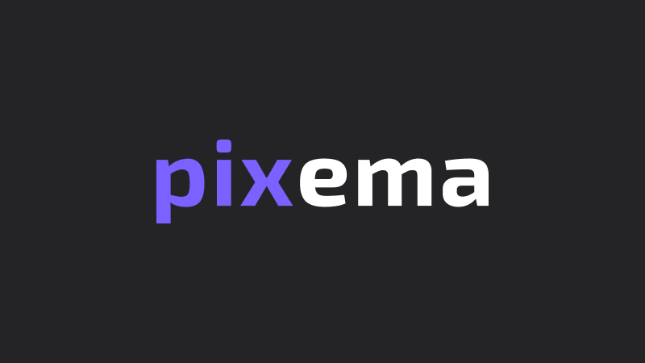
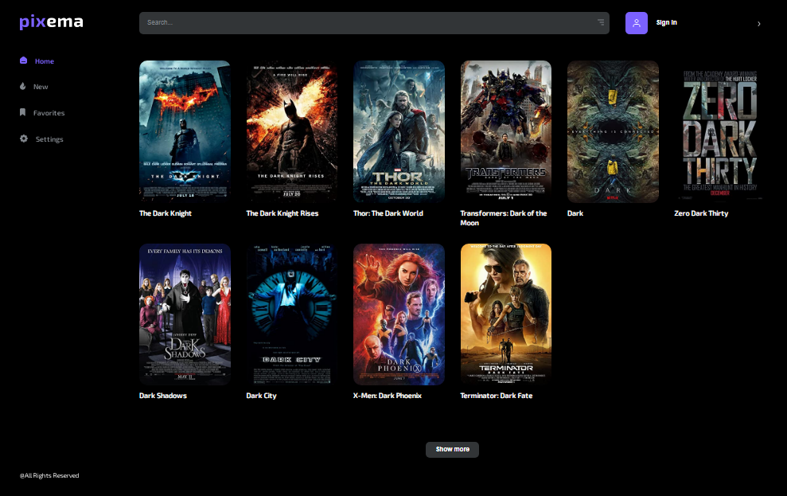
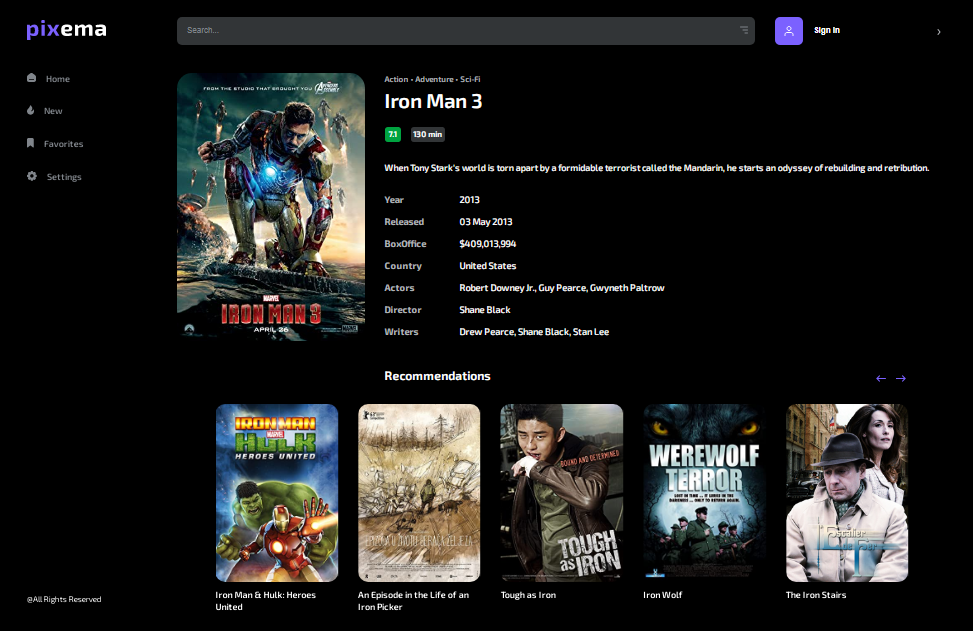
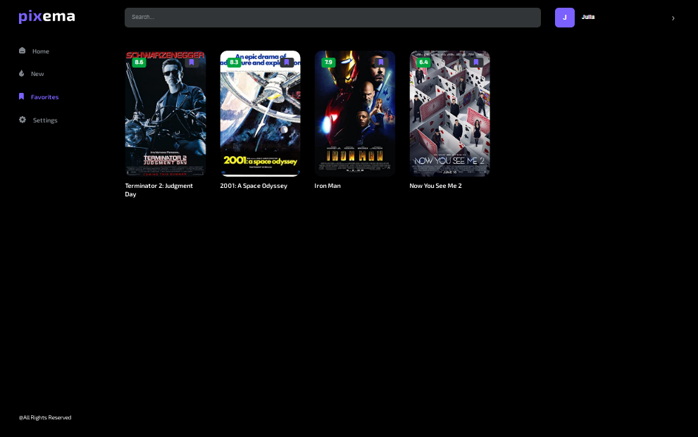
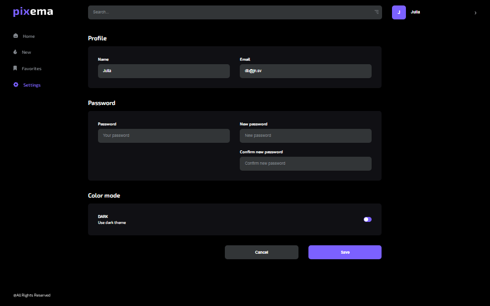
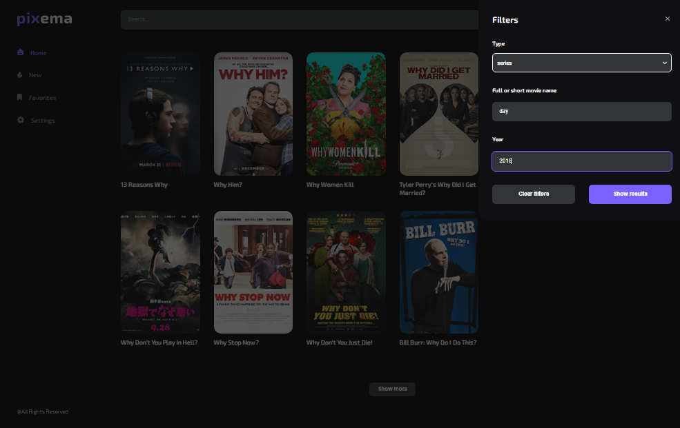

[![Contributors][contributors-shield]][contributors-url]
[![Forks][forks-shield]][forks-url]
[![Stargazers][stars-shield]][stars-url]
[![LinkedIn][linkedin-shield]][linkedin-url]

<br />
<div align="center">
  <a href="https://github.com/Julia-Kovalchuk/react-pixema">
    
  </a>

  <h3 align="center">Pixema</h3>

  <p align="center">
    Great service for finding movies
    <br />
    <a href="https://github.com/Julia-Kovalchuk/react-pixema"><strong>Explore the docs »</strong></a>
    <br />
    <br />
    This site is live <a href="https://julia-kovalchuk.github.io/react-pixema/">here</a>
  </p>
</div>

<!-- TABLE OF CONTENTS -->
<details>
  <summary>Table of Contents</summary>
  <ol>
    <li>
      <a href="#about-the-project">About The Project</a>
      <ul>
        <li><a href="#built-with">Built With</a></li>
      </ul>
    </li>
    <li>
      <a href="#getting-started">Getting Started</a>
      <ul>
        <li><a href="#prerequisites">Prerequisites</a></li>
        <li><a href="#installation">Installation</a></li>
      </ul>
    </li>
    <li><a href="#usage">Usage</a></li>
    <li><a href="#contact">Contact</a></li>
  </ol>
</details>

<!-- ABOUT THE PROJECT -->

## About The Project

   

Pixema is a modern movie search service in which you can:

- search for movies in the entire database, as well as separately among the latest new movies;
- read detailed information about the selected film;
- registered users can add their favorite movies to their favorites;
- you can simply register and, if necessary, change your password and email address, as well as your name in the settings section;
- change the design theme.

<p align="right">(<a href="#readme-top">back to top</a>)</p>

### Built With

This section should list any major frameworks/libraries used to bootstrap your project. Leave any add-ons/plugins for the acknowledgements section. Here are a few examples.

- [![React][react.js]][react-url]
- [![styled-components][styled-components]][styled-components-url]
- [![React Router][reactrouter.com]][react-router-url]
- [![React Hook Form][react-hook-form.com]][react-hook-form-url]
- [![React Select][react-select.com]][react-select-url]
- [![Redux Toolkit][redux-toolkit.js.org]][redux-url]
- [![Framer Motion][framer.com]][framer-url]
- [![Axios][axios-http.com]][axios-url]
- [![Firebase][firebase.google.com]][firebase-url]
- [![Redux Persist][github.com/rt2zz/redux-persist]][persist-url]

<p align="right">(<a href="#readme-top">back to top</a>)</p>

<!-- GETTING STARTED -->

## Getting Started

Use the `npm start` to get started.

### Prerequisites

Use the `npm install` to install all libraries.

### Installation

To use the local copy, follow these steps:

1. Get a free API Key at [![omdb-api][omdbapi.com]][omdb-api-url]
2. Clone the repo
   ```sh
   git clone https://github.com/Julia-Kovalchuk/react-pixema
   ```
3. Install NPM packages
   ```sh
   npm install
   ```
4. Enter your API in `.env`
   ```js
   REACT_APP_API_KEY = "ENTER YOUR API";
   ```

<p align="right">(<a href="#readme-top">back to top</a>)</p>

<!-- USAGE EXAMPLES -->

## Usage

Once on the home page, the user sees the first 10 movies provided by the open database (OMDb API).



By clicking on the movie card, you can see detailed information as well as recommended movies. On the detailed description page, registered users can add the movie to their favorites.



Registration forms are easy to use and you can learn more about them by visiting the site.

By signing up you can place your favorite movies in your favorites.



On the settings page you can change your name if you change your mind, change your email address and your password. You can also choose your favorite theme: light or dark.



And most importantly, search for movies by name, type, and year of release.



All other features of the site you can find out by testing it.

<p align="right">(<a href="#readme-top">back to top</a>)</p>

## Contact

Julia Kovalchuk - [@Juli_kovalchuk](telegram) - [https://www.linkedin.com/in/julia-kovalchuk-6608a2156/](linkedin)

Project Link: [https://github.com/Julia-Kovalchuk/react-pixema](https://github.com/Julia-Kovalchuk/react-pixema)

<p align="right">(<a href="#readme-top">back to top</a>)</p>

[contributors-shield]: https://img.shields.io/github/contributors/Julia-Kovalchuk/react-pixema.svg?style=for-the-badge
[contributors-url]: https://github.com/Julia-Kovalchuk/react-pixema/graphs/contributors
[forks-shield]: https://img.shields.io/github/forks/Julia-Kovalchuk/react-pixema.svg?style=for-the-badge
[forks-url]: https://github.com/Julia-Kovalchuk/react-pixema/network/members
[stars-shield]: https://img.shields.io/github/stars/Julia-Kovalchuk/react-pixema.svg?style=for-the-badge
[stars-url]: https://github.com/Julia-Kovalchuk/react-pixema/stargazers
[linkedin-shield]: https://img.shields.io/badge/-LinkedIn-black.svg?style=for-the-badge&logo=linkedin&colorB=555
[linkedin-url]: https://www.linkedin.com/in/julia-kovalchuk-6608a2156/
[typescriptlang.org]: https://img.shields.io/badge/-Typescript-blue?style=for-the-badge&logo=typescript&logoColor=white
[typescript-url]: https://www.typescriptlang.org/
[react.js]: https://img.shields.io/badge/React-20232A?style=for-the-badge&logo=react&logoColor=61DAFB
[react-url]: https://reactjs.org/
[axios-http.com]: https://img.shields.io/badge/-axios-671ddf?style=for-the-badge&logo=axios&logoColor=white
[axios-url]: https://axios-http.com/ru/docs/intro
[firebase.google.com]: https://img.shields.io/badge/-firebase-5f6368?style=for-the-badge&logo=firebase&logoColor=orange
[firebase-url]: https://firebase.google.com/docs/
[redux-toolkit.js.org]: https://img.shields.io/badge/-redux--toolkit-764abc?style=for-the-badge&logo=redux&logoColor=white
[redux-url]: https://redux-toolkit.js.org/
[react-hook-form.com]: https://img.shields.io/badge/-react--hook--form-1e2a4a?style=for-the-badge&logo=react-hook-form&logoColor=ec5990
[react-hook-form-url]: https://react-hook-form.com/
[github.com/rt2zz/redux-persist]: https://img.shields.io/badge/-redux--persist-persist?style=for-the-badge
[persist-url]: https://github.com/rt2zz/redux-persist#readme
[framer.com]: https://img.shields.io/badge/-framer--motion-DD0031?style=for-the-badge&logo=framer&logoColor=black
[framer-url]: https://www.framer.com/
[react-select.com]: https://img.shields.io/badge/-react--select-FF3E00?style=for-the-badge
[react-select-url]: https://react-select.com/home
[reactrouter.com]: https://img.shields.io/badge/React_Router-CA4245?style=for-the-badge&logo=react-router&logoColor=white
[react-router-url]: https://reactrouter.com/
[styled-components]: https://img.shields.io/badge/styled--components-DB7093?style=for-the-badge&logo=styled-components&logoColor=white
[styled-components-url]: https://styled-components.com/
[omdbapi.com]: https://img.shields.io/badge/-OMDb%20API%20-blue
[omdb-api-url]: http://www.omdbapi.com/
